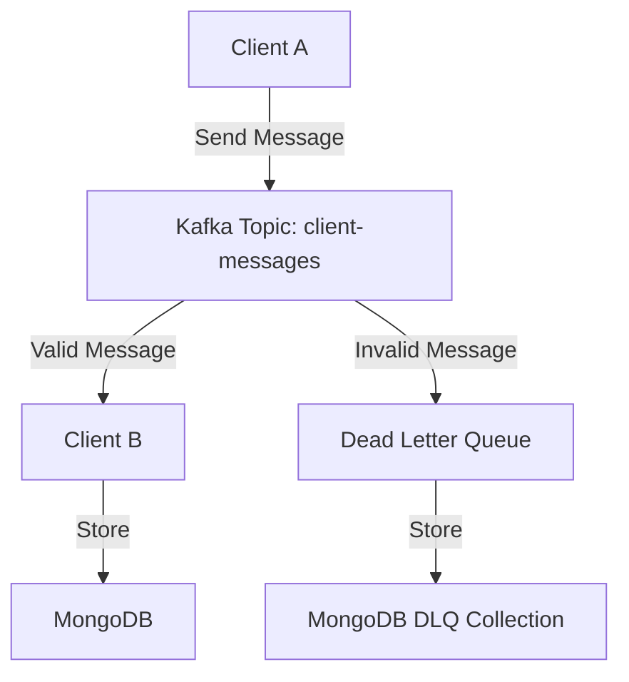

# 📬 Kafka Messaging Microservices (NestJS)

A scalable, event-driven microservices architecture using **Kafka**, **NestJS**, and **MongoDB**. Built with clean code principles and production-ready structure.

---

## 🚀 Features

-   🔄 **Client A**: Sends messages to Kafka
-   📥 **Client B**: Receives and stores valid messages in MongoDB
-   🛑 Invalid messages are routed to a **DLQ (Dead Letter Queue)**
-   🧰 Built-in **validation**, **logging**, and **error handling**
-   🐳 Dockerized setup (Kafka, Zookeeper, Clients)
-   📦 MongoDB Atlas used for persistent storage

---

## 🧠 Architecture



---

## 📦 Technologies Used

-   **NestJS** (Monorepo-ready structure)
-   **Kafka (KafkaJS + Zookeeper)**
-   **MongoDB Atlas**
-   **Docker + Docker Compose**
-   **ValidationPipe + Exception Filters**
-   **LoggerService (DEBUG / VERBOSE levels)**

---

## 📁 Folder Structure

```
kafka-messaging-task/
├── client-a-service/
│   ├── src/
│   │   ├── app.module.ts
│   │   ├── main.ts
│   │   ├── common/
│   │   ├── config/
│   │   ├── dto/
│   │   ├── modules/
│   │   └── test/
│   ├── test/
│   ├── Dockerfile
│   └── .env
│
├── client-b-service/
│   ├── src/
│   │   ├── app.module.ts
│   │   ├── main.ts
│   │   ├── common/
│   │   ├── config/
│   │   ├── modules/
│   │   │   └── messages/
│   ├── test/
│   ├── Dockerfile
│   └── .env
│
├── docker-compose.yml
├── README.md
└── .gitignore
```

---

## 🛠️ Setup Instructions

### ⚙️ Requirements

-   Docker + Docker Compose
-   Node.js v18+

### 🔧 Local Development

```bash
# 1️⃣ Clone this repo
git clone https://github.com/eDenxGT/kafka-nestjs-ms.git
cd kafka-messaging-task

# 2️⃣ Install dependencies
cd client-a-service && npm install
cd ../client-b-service && npm install

# 3️⃣ Setup .env files for each service
# Example .env:
MONGO_URI=mongodb+srv://<user>:<pass>@cluster.mongodb.net/kafka-ms-task
KAFKA_BROKER=kafka:9092
```

### 🐳 Docker Usage

```bash
# Build images
docker compose build

# Start services
docker compose up -d

# Stop services (without removing containers)
docker compose stop

# Restart all services
docker compose restart
```

### 🧪 Kafka Health Check

```bash
docker exec -it kafka bash
kafka-topics --bootstrap-server localhost:9092 --list
```

---

## 📨 API Routes (Client A)

| Method | Endpoint      | Description         |
| ------ | ------------- | ------------------- |
| POST   | /send-message | Send a message to B |

**Sample JSON Payload:**

```json
{
    "from": "client-a",
	"to": "client-b",
	"message": "Hello there!"
}
```

---

## 📂 MongoDB Collections

-   `messages`: Stores successfully received messages
-   `dlq_messages`: Stores invalid messages with retry potential

---

## 🛡️ Error Handling

-   All validation errors are caught by global pipes
-   DLQ stores any message not meant for client-b or failed after retries
-   Uses NestJS Logger for structured logs (verbose/debug/warn)

---

## 🧪 Test Cases

-   ✅ Valid message from A → saved in DB
-   ✅ Message with bad fields → saved to DLQ
-   ✅ Message not intended for B → ignored
-   ✅ Kafka offline → automatic retries handled

---

## 💡 Deployment Options

-   🌍 EC2 (recommended for full control)
-   ☁️ MongoDB Atlas for cloud DB
-   ☁️ Render / Railway (alternatives)

---

## 👨‍💻 Author

**[eDenGT](https://github.com/eDenxGT)** (Aadil)  
Passionate backend engineer & open-source enthusiast
